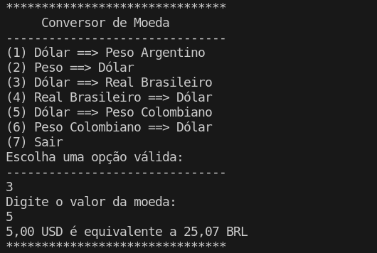

# Conversor de Moeda

Este é um programa em Java para converter moedas utilizando uma API de taxas de câmbio em tempo real.



## Funcionalidades

- Conversão entre diferentes moedas:
  - Dólar (USD)
  - Peso Argentino (ARS)
  - Real Brasileiro (BRL)
  - Peso Colombiano (COP)
  - Possibilidade de expansão para adicionar mais moedas

## Pré-requisitos

- JDK (Java Development Kit) instalado
- Conexão com a internet para acessar a API de taxas de câmbio

## Instalação

1. Clone o repositório para sua máquina local:

   ```bash
   git clone https://github.com/igorpereirag/conversor-de-moeda.git
   ```

2. Abra o projeto em sua IDE Java preferida.

## Uso

1. Execute a classe `Main` para iniciar o programa.

2. Siga as instruções no console para escolher a operação de conversão desejada e inserir os valores.

3. O resultado da conversão será exibido no console.

## Configuração da API

O programa utiliza a API de taxas de câmbio [ExchangeRate-API](https://www.exchangerate-api.com/). Você precisará obter uma chave de API gratuita em [https://www.exchangerate-api.com/](https://www.exchangerate-api.com/) e substituir a chave existente no código-fonte:

```java
String apiKey = "sua-chave-api-aqui";
```

## Contribuição

Contribuições são bem-vindas! Sinta-se à vontade para enviar sugestões, relatar problemas ou criar pull requests.

